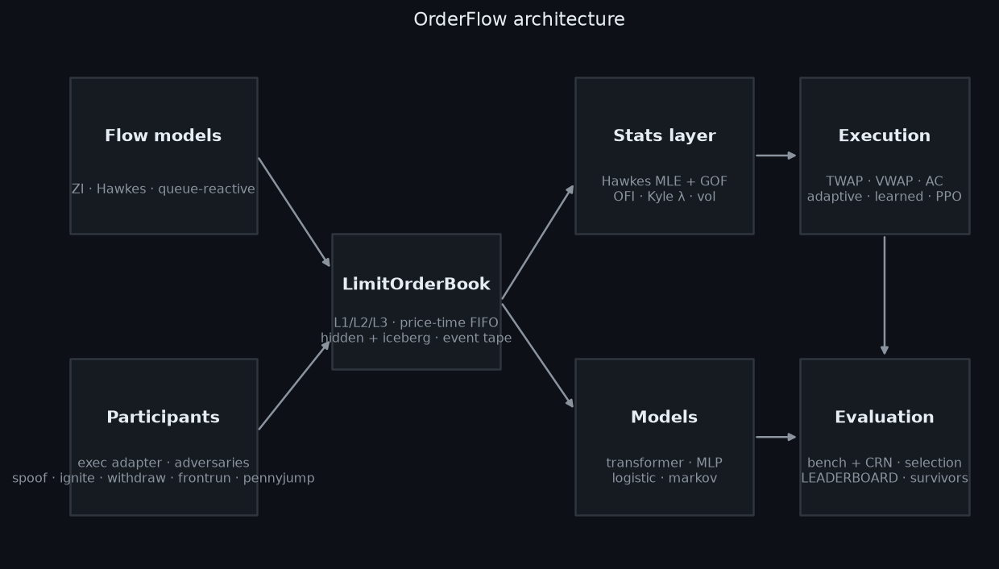
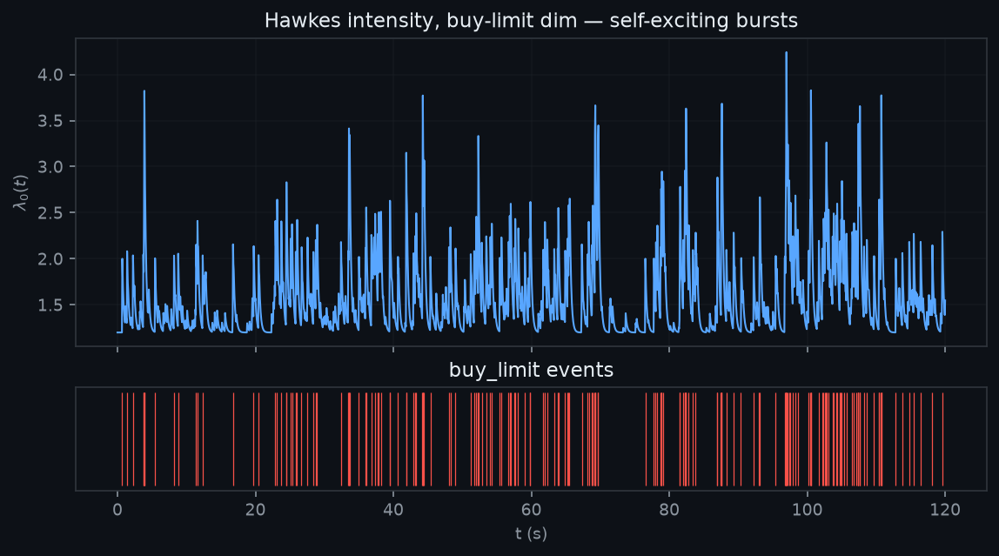
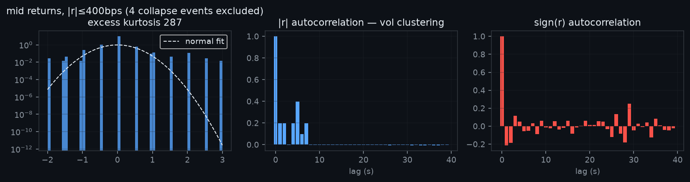
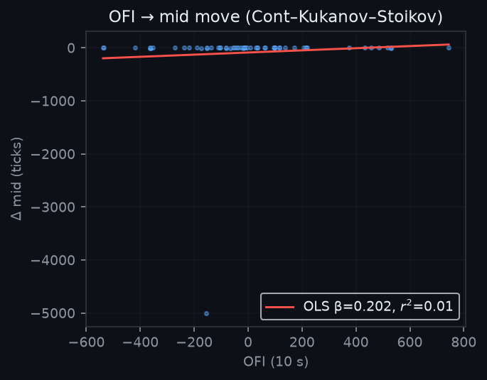
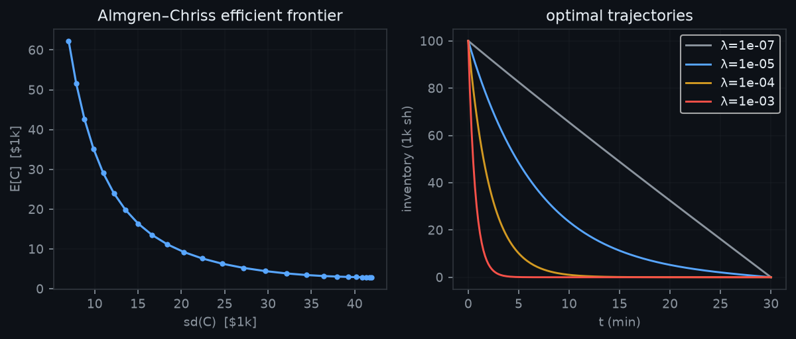
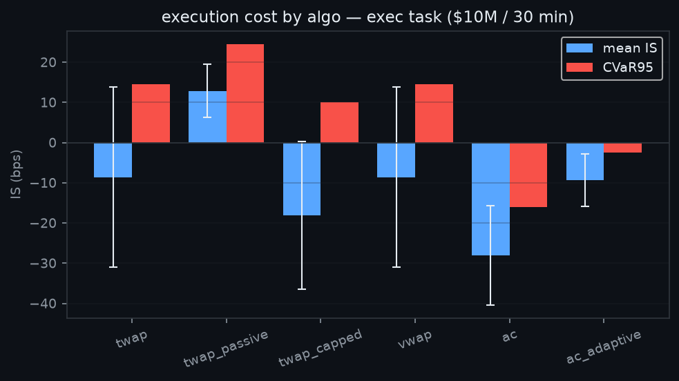

# OrderFlow

> **[▶ Live demo](https://rayhankhilji.github.io/orderflow-lob/)** — the research console, static build (baked data)

**A limit-order-book research and simulation environment** — matching engine,
stochastic order-flow generators, point-process statistics, neural event
models, an optimal-execution stack, adversarial participants, and a benchmark
harness that decides which implementations survive. Plus a FastAPI + React
console for watching the book breathe.

<p align="center">
  
</p>

The research question it exists to answer:

> *Given $10M of notional that must be executed over 30 minutes, which
> execution schedule minimizes expected cost — and which of the competing
> implementations survives a regime sweep, an adversarial cell, and a hard
> completion gate?*

Everything here runs on synthetic data from the in-repo simulator; there is
no market data dependency. The point is the *machinery*: an event tape is
generated by a self-exciting point process, books are formed by a real
price-time-priority engine, and every downstream number — Hawkes fits, OFI
coefficients, implementation shortfall — is measured on that tape.

```
python 3.12 · torch 2.2 · fastapi · react/vite · 115 tests green · ruff clean
```

## Contents

- [Install](#install)
- [Using OrderFlow](#using-orderflow) — dashboard, CLI, API
- [What's inside](#whats-inside) — the six layers
- [The book](#the-book) — matching engine invariants
- [Flow models](#flow-three-generators-one-interface)
- [Statistics](#statistics-does-the-sim-behave-like-a-market)
- [Models](#models-predicting-the-next-event)
- [Execution](#execution-the-10m-question)
- [Adversaries](#adversaries)
- [Selection](#selection) — the survival rule and final verdict
- [Research branches](#research-branches)

---

## What's inside

| layer | package | contents |
|---|---|---|
| Book | `orderflow/book/` | L1/L2/L3 book, price-time FIFO matching, partial fills, IOC/GTC, **hidden + iceberg** liquidity, queue position, event tape |
| Simulation | `orderflow/sim/` | event-driven simulator; zero-intelligence, **multivariate Hawkes** (Ogata thinning), and queue-reactive flow; five named regimes incl. `exec` (tuned so a 100k-share metaorder is ~13% participation) |
| Statistics | `orderflow/stats/` | Hawkes MLE (O(N) loglik), compensator-residual **goodness-of-fit**, OFI regression, Kyle λ, square-root law, vol estimators |
| Models | `orderflow/models/` | event tokeniser (9-dim state vector), Transformer next-event predictor, Markov/logistic/MLP baselines |
| Execution | `orderflow/execution/` | TWAP, VWAP, **Almgren–Chriss** (closed form + efficient frontier), `ac_adaptive` (online vol re-planning), `twap_capped` (depth-participation cap), `learned` (model-tilted AC), `rl` (Gymnasium env + PPO) |
| Evaluation | `orderflow/eval/` | seeded benchmark with common random numbers, five adversaries, the survival rule, leaderboard writer |
| API + UI | `orderflow/api/`, `web/` | FastAPI job server + React console: mid chart, L2 depth ladder, event tape, exec runner, leaderboard |

---

## The book

`LimitOrderBook` keeps per-price FIFO queues per side. Matching is
price-time priority; a market or marketable limit walks levels until its
quantity is gone or liquidity is. Events land on a typed tape
(submit/cancel/modify/fill) that everything downstream consumes.

```
orderbook invariant (checked by property tests):
  best_bid < best_ask          — never crossed
  sum(fills) == size taken     — quantity is conserved
  earlier order at same price  — fills first, always
```

Hidden orders still match but don't appear in L2 depth; iceberg orders show
only `display_qty` and requeue the rest. `queue_position(oid)` returns the
order's rank and the shares ahead of it — the quantity the queue-jumping
adversary attacks.

## Flow: three generators, one interface

Every flow model answers `next_event(book, t, rng) -> (dt, action)`.

- **ZI** — independent Poisson streams per event type.
- **Hawkes** — 6-dim exponential Hawkes,

  λ_i(t) = μ_i + Σ_j Σ_{t_l^j < t} α_ij e^{−β_ij (t − t_l^j)}

  simulated by Ogata thinning; `branching_ratio < 1` enforced.
- **Queue-reactive** — intensities scale with visible queue size at the first
  k levels (depth feeds back into the flow that made it).

Named regimes (`calm, normal, volatile, thin, stressed, exec`) map to
(flow params, book-seeding params); `stressed` has thin displayed depth
with 25% hidden liquidity — the tape looks fast while the book lies.

## Statistics: does the sim behave like a market?

`orderflow/stats/` asks the honest question. Compensator residuals under
the fitted Hawkes are i.i.d. Exp(1) by the random time change theorem —
`stats/goodness.py` computes them in O(n_i + n_j) per pair (validated to
machine precision against the O(N²) reference, including
simultaneous-event boundary collisions) and KS-tests per dimension.

Measured on `research/statistical/` runs (seed 7):

| quantity | truth | MLE | note |
|---|---|---|---|
| μ | 0.783/s | 0.728/s | −11% |
| β | 5.00 | 4.94 | −1.2% |
| α | — | — | 87% rel. err — needs ≫10³ events/dim |
| pooled residual KS p | — | 0.077 (truth) / 0.78 (fit) | Exp(1) not rejected |

and on the book: OFI→Δmid slope β ≈ 0.001 ticks/share, r² = 0.06 at 1 s
(t = 6.0) rising to 0.16 at 10 s buckets — the right order of magnitude for
this cadence; Kyle λ ≈ 1.8 ticks per 1 000 shares.

<p align="center">
  
  
  
</p>

## Models: predicting the next event

Events are tokenised into sequences of (type, Δt, side, level-offset, size,
state-vector). A causal Transformer with one head per target predicts the
factorized next-event distribution; baselines are Markov (type only),
per-target logistic heads, and an MLP trunk. Targets: `next_type`,
`mid_move`, `spread_change`, `cancel_prob`, `short_vol`,
`queue_depletion`. All are scored by held-out NLL; the survival rule
requires beating the Markov baseline on ≥ 4/6 targets.

## Execution: the $10M question

Interface: `ExecutionAlgo.decide(t, book, state) -> [ChildOrder]` — the algo
sees the live book and its own fill state; an adapter drives it on a 10 s
grid and force-liquidates residue at the deadline.

- **TWAP / TWAP-passive** — uniform slices, market vs best-price posting
- **VWAP** — slices ∝ fitted intraday volume profile (degenerates to TWAP
  on flat profiles — verified, not assumed)
- **Almgren–Chriss** — closed-form trajectory
  x_j = X·sinh κ(T−t_j)/sinh κT,  κ = acosh(1 + λσ²τ²/2η̃)/τ
  with sim-calibrated σ, η, γ → plus the efficient frontier
- **ac_adaptive** — re-solves κ every step from an EWMA vol estimate
- **twap_capped** — children capped at a fraction of displayed depth
- **learned** — AC spine tilted by the predictor: x′_j = x_j(1 + κ̃ s_j)
- **rl** — PPO policy (GAE, clipped objective, entropy bonus) on the
  Gymnasium env; actions are TWAP multiples a/5

Costs are reported as implementation shortfall in bps with a decomposition
(spread+impact leg vs timing/drift leg).

<p align="center">
  
  
</p>

## Adversaries

Five participants attack the footprint — four chase *market-order*
detection (spoofer, momentum igniter, liquidity withdrawer, frontrunner),
and the fifth, **PennyJumper**, detects large *passive* posts at the touch
and steps one tick inside them. The uplift matrix (agent/adversarial)
found the structural lesson: an algo that relies on a deadline-dump
backstop has a one-shot detectable vulnerability — `twap_passive` bleeds
+798 bps under the combined attack.

## Selection

`S = mean_IS_bps + 0.5·CVaR95_IS_bps`, averaged over regimes; an algo
survives only with completion ≥ 99.9% in *every* regime (adversarial cells
included). Latest generated table: `LEADERBOARD.md` + `survivors.json`
(repo root, reproduced by `python scripts/final_eval.py`).

**Final verdict (seed base 200): `learned` survives best** — robust score
−8.53 across five regimes and still completes under the combined attack.
`ac_adaptive` and `ac` also survive clean; but under attack static AC
manages only 50% completion on the flagship task (its front-loaded slices
are footprint-detectable) and the PPO policy collapses to 0% — trained on
the clean regime, its features go off-distribution under adversary flow.
The schedule algos are eliminated by the completion gate on `normal`,
where the deadline backstop fires into an empty bid side. Full matrix and
methodology: `EVALUATION.md`.

Headline matrix (mean IS bps, negative = beat arrival; `✓/✗` = survived
the ≥ 99.9% completion gate):

| algo | exec | normal | volatile | thin | stressed | @attack | verdict |
|---|---|---|---|---|---|---|---|
| **learned** | −43.9 | +1.6 | +1.2 | −0.3 | −0.8 | −57.5 ✓ | **survives** |
| ac_adaptive | −33.6 | +0.2 | +2.8 | +1.2 | +0.6 | −64.5 ✓ | survives |
| rl | −32.0 | −3.4 | +4.4 | +0.8 | +0.3 | 0% done ✗ | eliminated |
| ac | −17.4 | −1.1 | +5.5 | +1.8 | −0.1 | 50% done ✗ | eliminated |
| twap / vwap | −11.1 | 75% done | +2.2 | −0.2 | −5.7 | −34.8 ✓ | eliminated |
| twap_capped | +1.8 | 75% done | +2.2 | −0.5 | −3.5 | −3.3 ✓ | eliminated |
| twap_passive | +3.9 | 25% done | +5.8 | +0.1 | −2.4 | +9.1 ✗ | eliminated |

The pattern the table hides in plain sight: *every* failure here is a
completion failure, not a cost failure — on a book you can't see through,
the schedule that finishes is worth more than the schedule that's cheap.

## The console

```
uvicorn orderflow.api.app:app --port 8000     # API
cd web && npm install && npm run dev          # http://localhost:5173
```

**Live demo:** https://rayhankhilji.github.io/orderflow-lob/ — the same
console as a static build serving baked run data (no backend needed;
rebuilt via `python scripts/bake_demo.py && VITE_DEMO=1 npm run build`).

The console is a microscope for the machinery, not just a runner:

- **Execution anatomy** — every exec run returns a per-decision trace:
  the mid path with the algo's fills (dot size = shares), the inventory
  trajectory against the TWAP reference line, and a decision log of what
  it placed and when. Toggle any subset of the five adversaries on the
  run and watch e.g. `twap_passive` + `withdrawer` blow up live.
- **Almgren–Chriss frontier explorer** — closed-form, instant: slide
  risk-aversion λ and watch the E[cost]/std[cost] point move along the
  frontier while the optimal inventory schedule reshapes below.
- **Microstructure stats** — fit OFI→Δmid (β, r², t-stat, 1 s and 10 s
  windows), Kyle λ, excess kurtosis, and vol-clustering/trade-sign ACFs
  on a tape generated fresh per click.
- **Model lab** — the predictor benchmark table (held-out NLL per
  target per model, best cell highlighted) plus a live probe: the trained
  MLP's predicted P(mid move ↓/→/↑) vs what the tape actually did.

API additions: `/api/frontier`, `/api/stats`, `/api/models`,
`/api/probe`, `/api/adversaries`; `/api/exec` accepts `adversaries` and
returns a decision `trace`.

## Research branches

Six roles researched independently on `agent/*` branches; every one ships a
`research/<role>/REPORT.md` with its question, method, measured results and
decision. All merged.

| branch | headline finding |
|---|---|
| `agent/microstructure` | Hawkes flow produces fat tails (xkurt ≈ +27) and burst clustering but single-timescale memory |
| `agent/statistical` | Hawkes MLE nails μ/β; α is weakly identified at ≤2k events; residuals pass GOF under truth *and* under the fit (in-sample inflation — noted) |
| `agent/execution` | static AC is the robust-score champion; adaptive AC cuts dispersion ~47%; passive TWAP is adversely selected |
| `agent/rl` | PPO needs ≫40 episodes before reward shaping differentiates — plumbing certified, policy pending |
| `agent/adversarial` | withdrawer + deadline-dump = catastrophic +3334 bps on passive execs |
| `agent/benchmark` | pipeline produces explainable leaderboard; `stressed` regime added |

## Install

```bash
git clone https://github.com/rayhankhilji/orderflow-lob && cd orderflow-lob
uv venv .venv && uv pip install -e ".[dev]"    # or: python -m venv .venv && pip install -e .[dev]
pytest -q                                     # 115 tests, ~2 min
```

For the dashboard you also need Node ≥ 18:

```bash
cd web && npm install && npm run build        # dev mode: npm run dev
```

## Using OrderFlow

Three ways in, from most visual to most scriptable.

### 1. The dashboard

```bash
uvicorn orderflow.api.app:app --port 8000     # API  -> http://localhost:8000
cd web && npm run dev                          # UI   -> http://localhost:5173
```

Open **http://localhost:5173**. Three panels:

- **Simulation** — pick a regime (`normal`, `volatile`, `thin`, `stressed`,
  `exec`) and a flow model (`zi`, `hawkes`, `queue`), hit run. You get the
  mid-price path, the live L2 depth ladder, and the raw event tape.
- **Execution** — pick an algo (`twap`, `vwap`, `ac`, `ac_adaptive`,
  `learned`, `rl`, `twap_capped`, `twap_passive`), a size, and a horizon;
  it fills against the simulated book and reports implementation
  shortfall with the cost decomposition.
- **Leaderboard** — the survival table regenerated from
  `survivors.json`.

Try it: `exec` regime + `hawkes` flow + `ac` + `100000` shares +
`1800` s is the flagship $10M / 30-minute task.

### 2. The CLI

```bash
# watch a Hawkes-driven book for 5 minutes
python scripts/run_sim.py --flow hawkes --regime normal --horizon 300

# run one execution algo on the flagship task
python scripts/run_execution.py --algo ac --qty 100000 --horizon 1800

# algo x regime benchmark with paired bootstrap CIs
python scripts/run_benchmark.py

# reproduce every README figure
python scripts/make_figures.py                 # -> docs/figures/*.png

# the full study: train MLP+PPO, run the matrix, write LEADERBOARD.md
python scripts/final_eval.py                   # ~50 min; --skip-train reuses checkpoints
```

Every stochastic path takes an explicit `--seed`/`seed` argument —
same seed, same tape, same fills.

### 3. The API

```bash
curl -X POST localhost:8000/api/sim -H 'content-type: application/json' \
     -d '{"regime":"normal","flow":"hawkes","horizon":60,"seed":7}'
# -> {"job_id": "..."};  GET /api/jobs/{id} -> mid series, depth ladder, tape

curl -X POST localhost:8000/api/exec -H 'content-type: application/json' \
     -d '{"algo":"ac","regime":"exec","total_qty":100000,"horizon":1800,"n_episodes":2}'
# -> per-episode IS bps, completion, participation, cost decomposition

curl localhost:8000/api/leaderboard            # survivors + robust scores
```

Jobs run in the background; `GET /api/jobs/{job_id}` polls until
`status == "done"`.

Repo layout, interfaces, and invariants: `ARCHITECTURE.md`.
Eval methodology and the survivor decision: `EVALUATION.md`.

---

*Built as a research showcase: probability, statistics, optimization, ML,
simulation, and systems — not just a PyTorch demo.*
